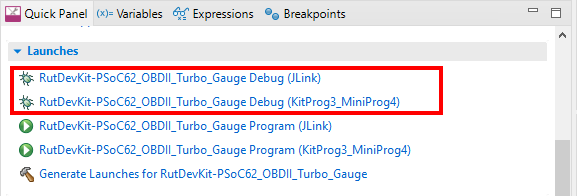

# RutDevKit-PSoC62 OBD-II Turbine Pressure Gauge Demo

Rutronik Development Kit Programmable System-on-Chip CY8C6245AZI-S3D72 "RutDevKit-PSoC62_OBDII_Turbo_Gauge" Demo Application. 

This example is a practical implementation using 4D Systems "GEN4-FT812-43T" display for representing the vehicle's parameters gathered over the OBD cable using OBD-II protocol.  The OBD cable and SPI adapter is needed for this application to run. 

 

## Requirements

- [ModusToolbox® software](https://www.infineon.com/cms/en/design-support/tools/sdk/modustoolbox-software/) v2.4

### Using the code example with a ModusToolbox IDE:

1. Import the project: **File** > **Import...** > **General** > **Existing Projects into Workspace** > **Next**.
2. Select the directory where **"RutDevKit-PSoC62_OBDII_Turbo_Gauge"** resides and click  **Finish**.
3. Update the libraries using a **"Library Manager"** tool.
4. Select and build the project **Project ** > **Build Project**.

### Operation

The library  was ported for the PSoC62 from the **"EVE2 / EVE3 / EVE4 code library"** provided by Rudolph Riedel on GitHub:

[`https://github.com/RudolphRiedel/FT800-FT813`](https://github.com/RudolphRiedel/FT800-FT813)

The demo application has a gauge that represents turbocharger boost. It is calculated as it is shown below:

`Turbo Boost (kPa) = Atmospheric Pressure (kPa) - MAP Mainfold Air Pressure (kPa)`

Other values (battery voltage, engine speed, MAP, air intake temperature, MAF) are represented together with icons that are sensitive for touching and can be enabled or disabled when touched.

### OBD-II Cable for RutDevKit-PSoC62

Though the CAN FD cable is provided together with RutDevKit-PSoC62 development kit, the socket has to be purchased and assembled additionally. Please contact the support for further information

 

### Debugging

If you successfully have imported the example, the debug configurations are already prepared to use with a the KitProg3, MiniProg4, or J-link. Open the ModusToolbox perspective and find the Quick Panel. Click on the desired debug launch configuration and wait for the programming to complete and debugging process to start.

## Legal Disclaimer

The evaluation board including the software is for testing purposes only and, because it has limited functions and limited resilience, is not suitable for permanent use under real conditions. If the evaluation board is nevertheless used under real conditions, this is done at one’s responsibility; any liability of Rutronik is insofar excluded. 

